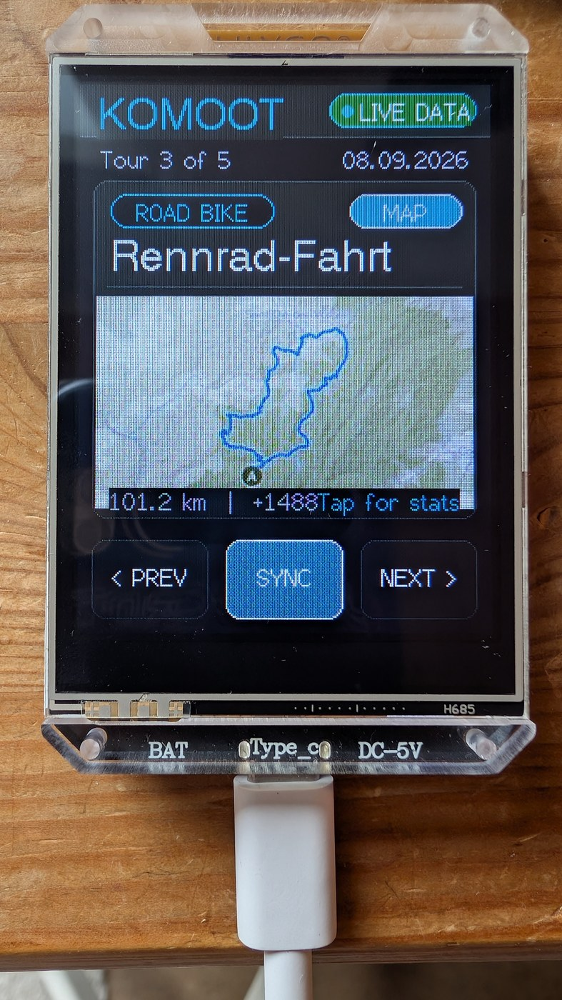

# Demo 2: Komoot Tour & Training Viewer for LILYGO T-HMI

This demo for the **LILYGO T-HMI (ESP32-S3)** connects over Wi-Fi to Komoot's official REST API to display your latest recorded bike rides, runs, and hikes directly on the 2.8" color screen.

<p align="left">
  
</p>

## Features
- Connects securely to `api.komoot.de` over HTTPS using your Komoot credentials.
- Automatically fetches your latest completed / driven tours.
- Interactive Touch Navigation:
  - Tap **[ ◀ PREV ]** and **[ NEXT ▶ ]** to page through your workouts.
  - Tap **[ 🔄 SYNC ]** to refresh live over Wi-Fi.
- Displays key training metrics:
  - Tour Name & Sport Type (Cycling, Gravel, MTB, Running, Hiking)
  - Distance (km)
  - Moving Time (hours & minutes)
  - Elevation Gain (meters climbed)
  - Average Speed (km/h) & Calories
- Includes offline sample data if Wi-Fi / credentials are not yet configured.
- Uses persistent touch calibration stored in Flash NVS (`Preferences`).
- **Power Saving Standby:** Automatically turns off the screen backlight after 2 minutes of inactivity to save power. Tap anywhere on the screen or press the **BOOT button** to wake it back up.

## Configuration
Copy `include/secrets.h.example` to `include/secrets.h` and enter your credentials:
```cpp
#define WIFI_SSID       "YOUR_WIFI_NAME"
#define WIFI_PASSWORD   "YOUR_WIFI_PASSWORD"

#define KOMOOT_EMAIL    "YOUR_KOMOOT_EMAIL"
#define KOMOOT_PASSWORD "YOUR_KOMOOT_PASSWORD"
```
(`include/secrets.h` is ignored by Git and will not be committed).

## How to activate this demo
To build and flash this demo, keep `src_dir = src` in `platformio.ini` (since this code is copied to `src/main.cpp`), or set:
```ini
[platformio]
src_dir = demos/02_komoot_tours
```
